# Automated vSphere with Tanzu Basic Lab Deployment

## Table of Contents

* [Description](#description)
* [Changelog](#changelog)
* [Requirements](#requirements)
* [FAQ](#faq)
* [Configuration](#configuration)
* [Logging](#logging)
* [Sample Execution](#sample-execution)
    * [Lab Deployment Script](#lab-deployment-script)
    * [Enable Workload Management](#enable-workload-management)
    * [Create Namespace](#create-namespace)
    * [Deploy Tanzu Kubernetes Cluster](#deploy-tanzu-kubernetes-cluster)

## Description

Similar to previous "Automated Lab Deployment Scripts" (such as [here](https://www.virtuallyghetto.com/2016/11/vghetto-automated-vsphere-lab-deployment-for-vsphere-6-0u2-vsphere-6-5.html), [here](https://www.virtuallyghetto.com/2017/10/vghetto-automated-nsx-t-2-0-lab-deployment.html), [here](https://www.virtuallyghetto.com/2018/06/vghetto-automated-pivotal-container-service-pks-lab-deployment.html) and [here](https://www.virtuallyghetto.com/2020/04/automated-vsphere-7-and-vsphere-with-kubernetes-lab-deployment-script.html)), this script makes it very easy for anyone with vSphere 7.0 Update 1 to deploy the new simplified vSphere with Tanzu Basic in a Nested Lab environment for learning and educational purposes. All required VMware components (ESXi, vCenter Server and HAProxy VMs) are automatically deployed and configured to allow enablement of vSphere with Tanzu Basic. For more details about vSphere with Tanzu, please refer to the official VMware documentation [here](https://docs.vmware.com/en/VMware-vSphere/7.0/vmware-vsphere-with-tanzu/GUID-C163490C-BE03-4DFE-8A03-5316D3245765.html).

Below is a diagram of what is deployed as part of the solution and you simply need to have an existing vSphere environment running that is managed by vCenter Server and with enough resources (CPU, Memory and Storage) to deploy this "Nested" lab. For a complete end-to-end example including workload management enablement (post-deployment operation) and the deployment of a Tanzu Kubernetes Grid (TKG) Cluster, please have a look at the [Sample Execution](#sample-execution) section below.

You are now ready to get your K8s on! 😁

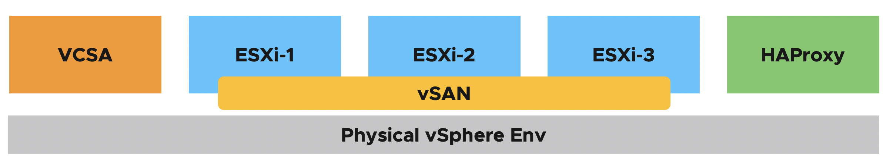

## Changelog

* **10/13/2020**
  * Initial Release

## Requirements
* vCenter Server running at least vSphere 6.7 or later
    * If your physical storage is vSAN, please ensure you've applied the following setting as mentioned [here](https://www.virtuallyghetto.com/2013/11/how-to-run-nested-esxi-on-top-of-vsan.html)
* Resource Requirements
    * Compute
        * Ability to provision VMs with up to 4 vCPU
        * Ability to provision up to 84 GB of memory
    * Network
        * 1 x Standard or Distributed Portgroup (routable) to deploy all VMs (vSphere Management + Supervisor Management)
           * 5 x IP Addresses for VCSA, ESXi and HAProxy VM
           * 5 x Consecutive IP Addresses for Kubernetes Control Plane VMs
        * 1 x Standard or Distributed Portgroup (routable) for combined Load Balancer IPs + Workload Network
            * IP Range for HAProxy Load Balancer addresses (e.g. 172.17.36.0/25)
            * IP Range for Workload Network (e.g. 172.17.36.128/25)
    * Storage
        * Ability to provision up to 1TB of storage

        **Note:** For detailed requirements, plesae refer to the official document [here](https://docs.vmware.com/en/VMware-vSphere/7.0/vmware-vsphere-with-tanzu/GUID-EE236215-DA4D-4579-8BEB-A693D1882C77.html)

* Desktop (Windows, Mac or Linux) with latest PowerShell Core and PowerCLI 12.1 Core installed. See [ instructions here](https://blogs.vmware.com/PowerCLI/2018/03/installing-powercli-10-0-0-macos.html) for more details
* vSphere 7 Update 1 & HAProxy OVAs:
    * [vCenter Server Appliance 7.0 Build 16860138](https://my.vmware.com/group/vmware/downloads/details?downloadGroup=VC70U1&productId=974&rPId=52847)
    * [HAProxy v0.1.8 OVA](https://cdn.haproxy.com/download/haproxy/vsphere/ova/vmware-haproxy-v0.1.8.ova)
    * [Nested ESXi 7.0 Update 1 OVA](https://download3.vmware.com/software/vmw-tools/nested-esxi/Nested_ESXi7.0u1_Appliance_Template_v1.ova)

## FAQ

1) Can I reduce the default CPU, Memory and Storage resources?

    * You can, see this [blog post](https://www.virtuallyghetto.com/2020/04/deploying-a-minimal-vsphere-with-kubernetes-environment.html) for more details.

3) Can I just deploy vSphere (VCSA, ESXi) and vSAN without HAProxy and vSphere with Tanzu?

    * Yes, simply search for the following variables and change their values to `0` to not deploy Tanzu components or run through the configurations

        ```
        $deployHAProxy = 0
        $setupPacificStoragePolicy = 0
        $setupPacific = 0
        ```
6) How do I enable vSphere with Kubernetes after the script has completed?

    * Please see [Enable Workload Management](#enable-workload-management) section for instructions

7) How do I troubleshoot enabling or consuming vSphere with Tanzu?

    * Please refer to this [troubleshooting tips for vSphere with Kubernetes](https://www.virtuallyghetto.com/2020/05/troubleshooting-tips-for-configuring-vsphere-with-kubernetes.html) blog post

8) Is there a way to automate the enablement of Workload Management to a vSphere Cluster?

    * Yes, the [Workload Management PowerCLI Module for automating vSphere with Tanzu](https://www.virtuallyghetto.com/2020/05/workload-management-powercli-module-for-automating-vsphere-with-kubernetes.html) will be updated later this week that will support the new workflow

9) Can I deploy vSphere with Tanzu using NSX-T instead of HAProxy?
    * Yes, you will need to use the previous version of the [Automated vSphere with Kubernetes deployment script](https://www.virtuallyghetto.com/2020/04/automated-vsphere-7-and-vsphere-with-kubernetes-lab-deployment-script.html) and substituting the vSphere 7.0 Update 1 images

## Configuration

Before you can run the script, you will need to edit the script and update a number of variables to match your deployment environment. Details on each section is described below including actual values used in my home lab environment.

This section describes the credentials to your physical vCenter Server in which the Project Pacific lab environment will be deployed to:
```console
$VIServer = "mgmt-vcsa-01.cpbu.corp"
$VIUsername = "administrator@vsphere.local"
$VIPassword = "VMware1!"
```

This section describes the location of the files required for deployment.

```console
$NestedESXiApplianceOVA = "C:\Users\tanzu\Desktop\tanzu\Nested_ESXi7.0u1_Appliance_Template_v1.ova"
$VCSAInstallerPath = "C:\Users\tanzu\Desktop\tanzu\VMware-VCSA-all-7.0.1-15952498"
$HAProxyOVA = "C:\Users\tanzu\Desktop\tanzu\haproxy-v0.1.8.ova"
```
**Note:** The path to the VCSA Installer must be the extracted contents of the ISO

This section describes the Tanzu Kubernetes Grid vSphere Content Library to subscribed from. This should be left alone and just ensure your environment has outbound connectivity to this endpoint

```console
$TKGContentLibraryName = "TKG-Content-Library"
$TKGContentLibraryURL = "https://wp-content.vmware.com/v2/latest/lib.json"
```

This section defines the number of Nested ESXi VMs to deploy along with their associated IP Address(s). The names are merely the display name of the VMs when deployed. At a minimum, you should deploy at least three hosts, but you can always add additional hosts and the script will automatically take care of provisioning them correctly.
```console
$NestedESXiHostnameToIPs = @{
    "tanzu-esxi-1" = "172.17.31.113"
    "tanzu-esxi-2" = "172.17.31.114"
    "tanzu-esxi-3" = "172.17.31.115"
}
```

This section describes the resources allocated to each of the Nested ESXi VM(s). Depending on your usage, you may need to increase the resources. For Memory and Disk configuration, the unit is in GB.
```console
$NestedESXivCPU = "4"
$NestedESXivMEM = "32" #GB
$NestedESXiCachingvDisk = "8" #GB
$NestedESXiCapacityvDisk = "150" #GB
```

This section describes the VCSA deployment configuration such as the VCSA deployment size, Networking & SSO configurations. If you have ever used the VCSA CLI Installer, these options should look familiar.
```console
$VCSADeploymentSize = "tiny"
$VCSADisplayName = "tanzu-vcsa-1"
$VCSAIPAddress = "172.17.31.112"
$VCSAHostname = "tanzu-vcsa-1.cpbu.corp" #Change to IP if you don't have valid DNS
$VCSAPrefix = "24"
$VCSASSODomainName = "vsphere.local"
$VCSASSOPassword = "VMware1!"
$VCSARootPassword = "VMware1!"
$VCSASSHEnable = "true"
```

This section describes the HAProxy VM configurations

```console
$HAProxyDisplayName = "tanzu-haproxy-1"
$HAProxyManagementIPAddress = "172.17.31.116/24" # Format is IP Address/CIDR Prefix
$HAProxyHostname = "tanzu-haproxy-1.cpbu.corp"
$HAProxyPort = "5556"
$HAProxyWorkloadIPAddress = "172.17.36.128/24" # Format is IP Address/CIDR Prefix
$HAProxyWorkloadGateway = "172.17.36.1"
$HAProxyWorkloadNetworkIPRange = "172.17.36.0/25" # Format is Network CIDR Notation
$HAProxyWorkloadNetwork = "Workload-1736"
$HAProxyOSPassword = "VMware1!"
$HAProxyUsername = "wcp"
$HAProxyPassword = "VMware1!"
```

This section describes the location as well as the generic networking settings applied to Nested ESXi VCSA & NSX VMs
```console
$VMDatacenter = "San Jose"
$VMCluster = "Cluster-02"
$VMNetwork = "Management-1731"
$VMDatastore = "vsanDatastore (1)"
$VMNetmask = "255.255.255.0"
$VMGateway = "172.17.31.1"
$VMDNS = "172.17.31.5"
$VMNTP = "172.17.31.5"
$VMPassword = "VMware1!"
$VMDomain = "cpbu.corp"
$VMSyslog = "172.17.31.80"
$VMFolder = "Tanzu"
# Applicable to Nested ESXi only
$VMSSH = "true"
$VMVMFS = "false"
```

This section describes the configuration of the new vCenter Server from the deployed VCSA. **Default values are sufficient.**
```console
$NewVCDatacenterName = "Tanzu-Datacenter"
$NewVCVSANClusterName = "Workload-Cluster"
$NewVCVDSName = "Tanzu-VDS"
$NewVCMgmtPortgroupName = "DVPG-Supervisor-Management-Network"
$NewVCWorkloadPortgroupName = "DVPG-Workload-Network"
```

This section describes the Tanzu Configurations. **Default values are sufficient.**
```console
$StoragePolicyName = "tanzu-gold-storage-policy"
$StoragePolicyTagCategory = "tanzu-demo-tag-category"
$StoragePolicyTagName = "tanzu-demo-storage"
$DevOpsUsername = "devops"
$DevOpsPassword = "VMware1!"
```
Once you have saved your changes, you can now run the PowerCLI script as you normally would.

## Logging

There is additional verbose logging that outputs as a log file in your current working directory **tanzu-basic-lab-deployment.log**

## Sample Execution

In this example below, I will be using a two /24 VLANs (172.17.31.0/24 and 172.17.36.0/24). The first network will be used to provision all VMs and place them under typical vSphere Management network configuration and 5 IPs will be allocated from this range for the Supervisor Control Plane. The second network will combine both IP ranges for HAProxy Load Balancer as well as IP ranges for Workloads. See the table below for the explicit network mappings and it is expected you have a setup similiar to what has been outlined.

| Hostname                  | IP Address                  | Function                                               |
|---------------------------|-----------------------------|--------------------------------------------------------|
| tanzu-vcsa-1.cpbu.corp    | 172.17.31.112               | vCenter Server                                         |
| tanzu-esxi-1.cpbu.corp    | 172.17.31.113               | ESXi-1                                                 |
| tanzu-esxi-2.cpbu.corp    | 172.17.31.114               | ESXi-2                                                 |
| tanzu-esxi-3.cpbu.corp    | 172.17.31.115               | ESXi-3                                                 |
| tanzu-haproxy-1.cpbu.corp | 172.17.31.116               | HAProxy                                                |
| N/A                       | 172.17.31.120-172.17.31.125 | Supervisor Control Plane (last 5 IPs from above range) |
| N/A                       | 172.17.36.2-172.17.36.125   | HAProxy Load Balancer IP Range                         |
| N/A                       | 172.17.36.128               | HAProxy Workload IP Address                            |
| N/A                       | 172.17.36.130-172.17.36.150 | Workload IP Range                                      |

### Lab Deployment Script

Here is a screenshot of running the script if all basic pre-reqs have been  met and the confirmation message before starting the deployment:

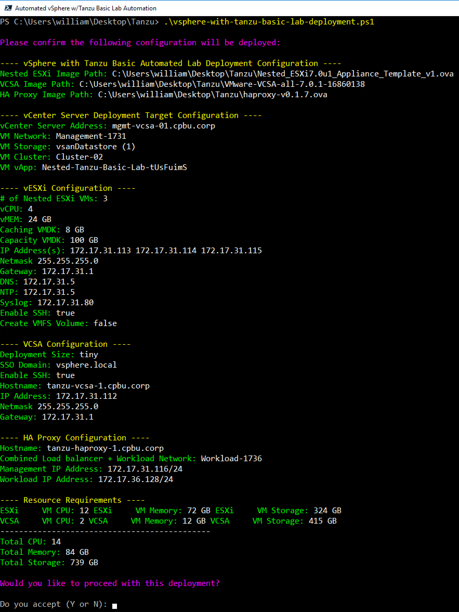

Here is an example output of a complete deployment:

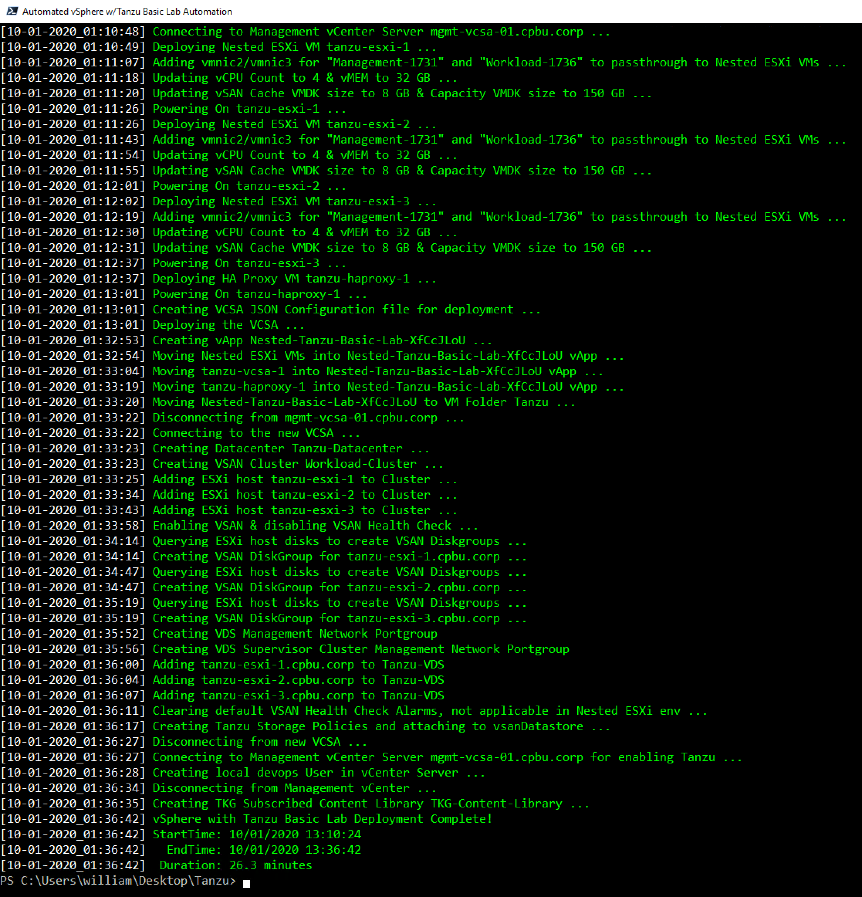

**Note:** Deployment time will vary based on underlying physical infrastructure resources. In my lab, this took ~40min to complete.

Once completed, you will end up with your deployed vSphere with Kubernetes Lab which is placed into a vApp

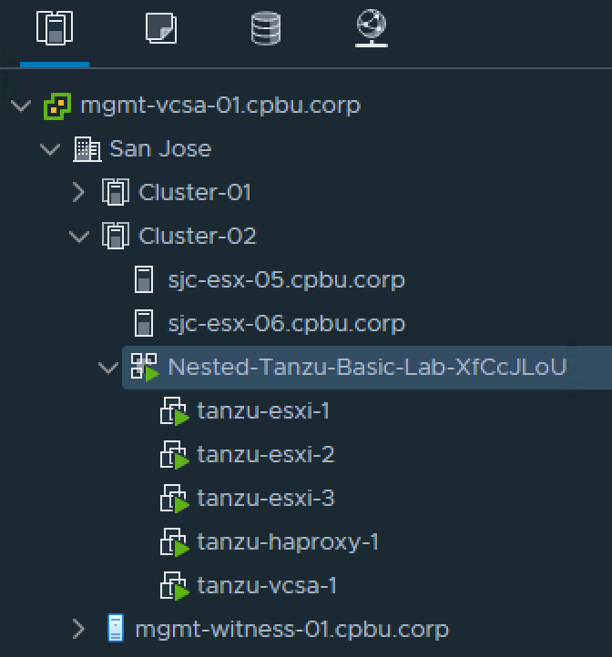

### Enable Workload Management

To consume the vSphere with Tanzu capability in vSphere 7.0 Update 1, you must enable workload management on a specific vSphere Cluster, which is  not part of the automation script. The instructions below outline the steps and configuration values used in my example. For more details, please refer to the official VMware documentation [here](https://docs.vmware.com/en/VMware-vSphere/7.0/vmware-vsphere-with-kubernetes/GUID-21ABC792-0A23-40EF-8D37-0367B483585E.html).

Step 1 - Login to vSphere UI and click on `Menu->Workload Management` and fill out the evaluation form to begin trying out vSphere with Tanzu

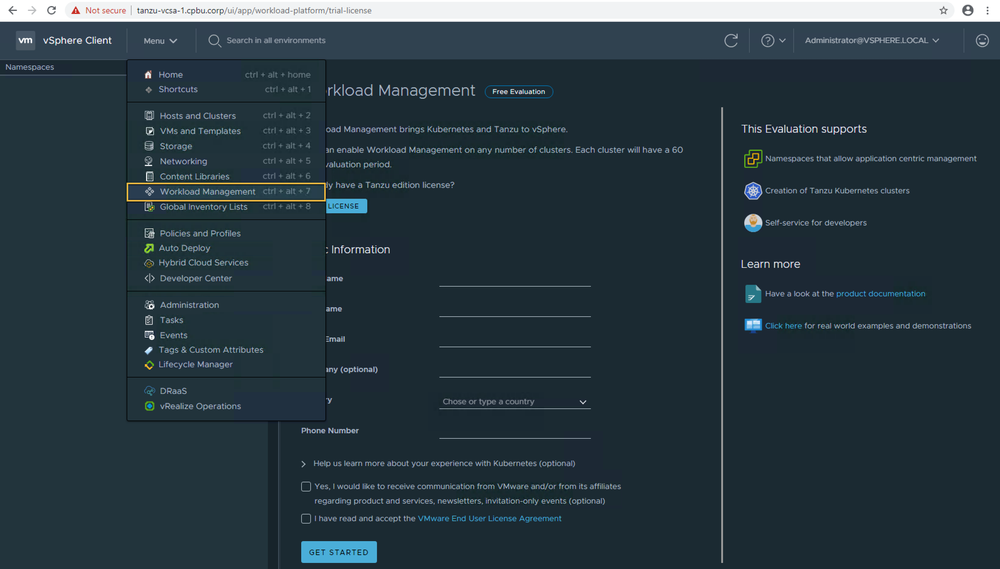

Step 2 - Select next to choose `vCenter Server Network` since we are not using NSX-T for our networking

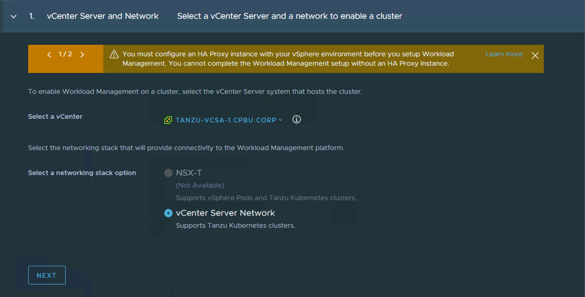

Step 3 - Select the `Workload-Cluster` which should show up under the Compatible column

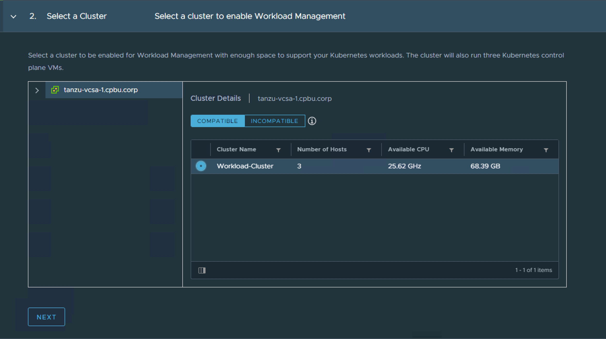

Step 4 - Select the Kubernetes Control Plane Size which you can use `Tiny`

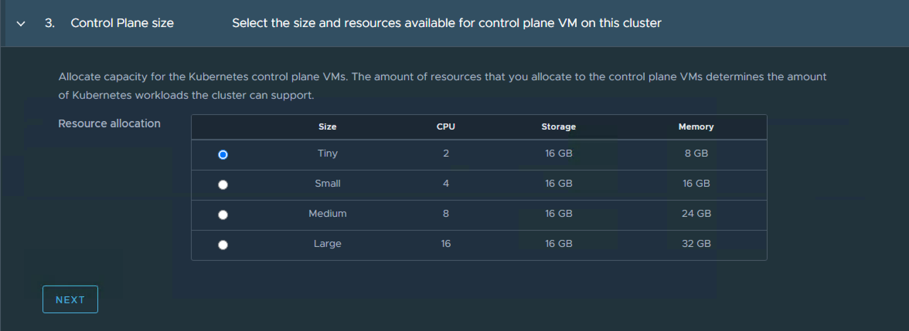

Step 5 - Select the `tanzu-gold-storage-policy` VM Storage Policy

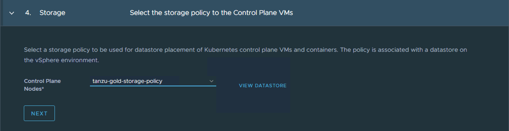

Step 6 - Configure the Load Balancer configuration where you will specify the settings from our HAProxy deployment. To retrieve the Server Certificate Authority, you will need to SSH to the HAProxy VM and paste the contents from `/etc/haproxy/ca.crt`

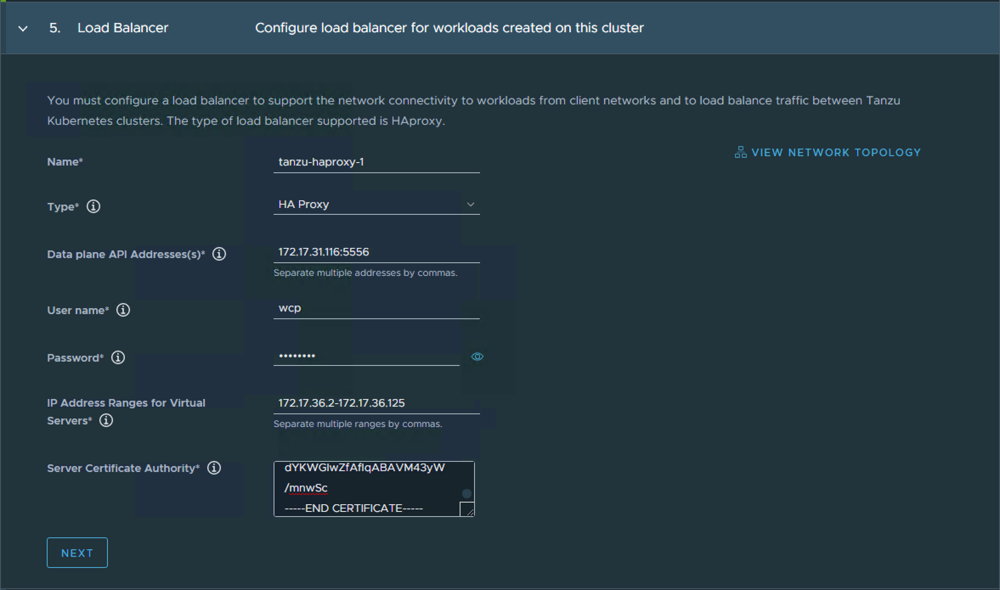

Step 7 - Configure the Management Network by selecting the `DVPG-Supervisor-Management-Network` distributed portgroup which is automatically created for you as part of the automation. Fill out the rest of the network configuration based on your environment

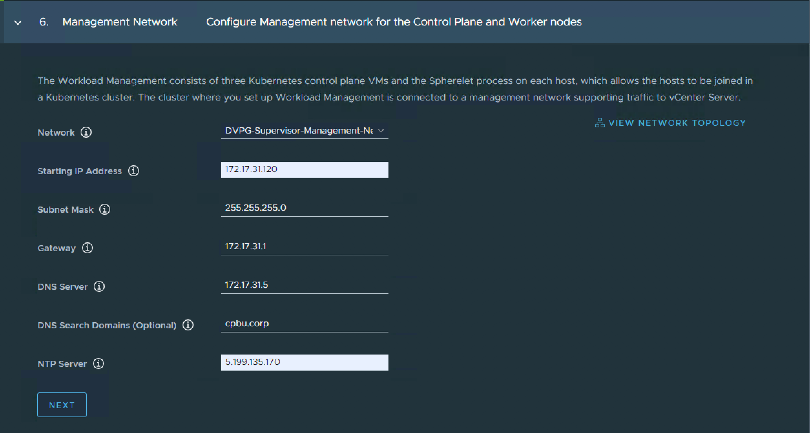

Step 8 - Configure the Workload Network by click on Add and provide a label (network-1) and select `DVPG-Workload-Network` which is automatically created for you as part of the automation. Fill in the routing configuration based on your environment and specify range of IP Addresses which will be used to deploy Tanzu Kubernetes Grid Clusters.

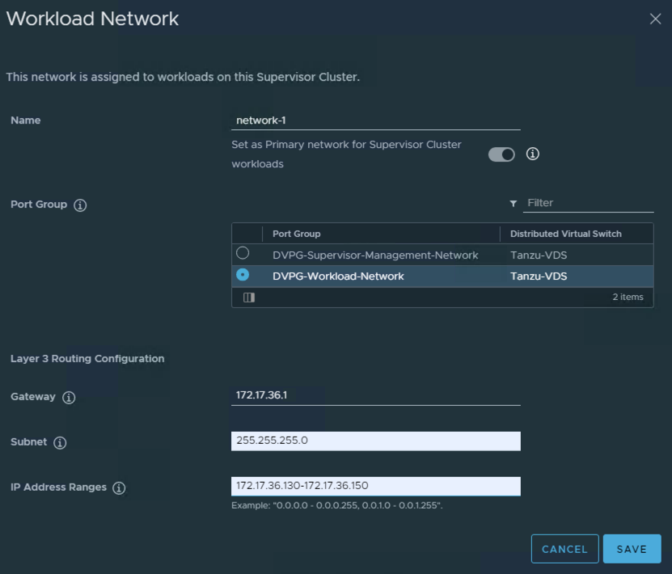

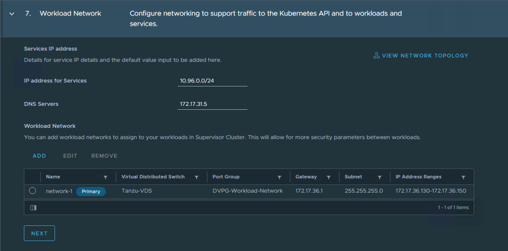

Step 9 - Select the `TKG-Content-Library` which was automatically subscribed to as part of the Automation.

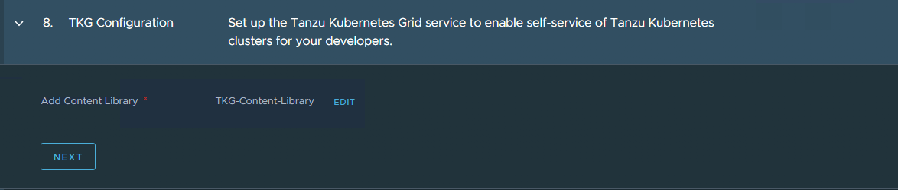

Step 10 - Finally, review workload management configuration and click `Finish` to begin the deployment.

This will take some time depending on your environment and you will see various errors on the screen, that is expected. In my example, it took ~25 minutes to complete. You will know when it is completely done when you refreshed the workload management UI and you see a `Running` status along with an accessible Control PLane Node IP Address, in my case it is `172.17.31.2`

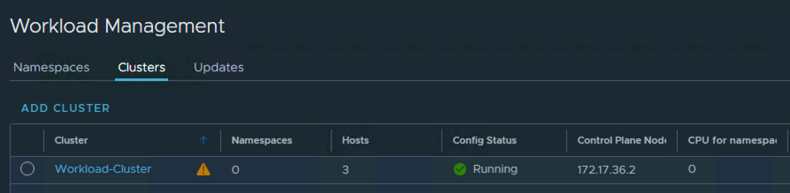

### Create Namespace

Before we can deploy Tanzu Kubernetes Grid Cluster, we need to first create a vSphere Namespace and assign a user and VM Storage Policy.

Step 1 - Under the `Namespaces` tab within the workload management UI, select the Supervisor Cluster (aka vSphere Cluster enabled with workload management) and provide a name and leave the default network which should be `network-1` as created by the automation.

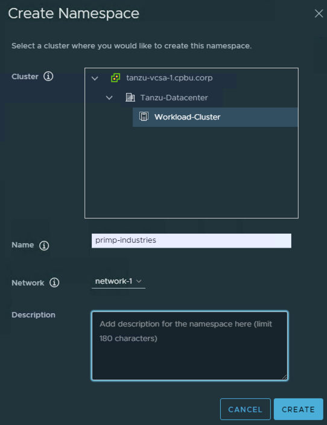

Step 2 - Click on `Add Permissions` to assign both the user `administrator@vsphere.local` and `devops@vsphere.local` which was automatically created by the Automation or any other valid user within vSphere to be able to deploy workloads.

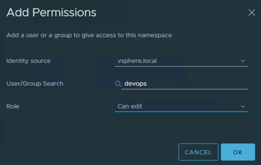

Step 3 - Click on `Edit Storage` to assign the VM Storage Policy `tanzu-gold-storage-policy` or any other valid VM Storage Policy.

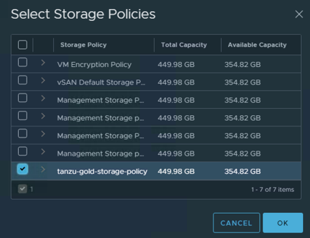

Step 4 - Finally click on the `Open` URL under the Namespace Status tile to download kubectl and vSphere plugin and extract that onto your desktop.


### Deploy Tanzu Kubernetes Cluster

Step 1 - Login to Supervisor Control Plane using kubectl

```console
.\kubectl.exe vsphere login --server=172.17.36.2 -u administrator@vsphere.local --insecure-skip-tls-verify

Password:
Logged in successfully.

You have access to the following contexts:
   172.17.36.2
   primp-industries

If the context you wish to use is not in this list, you may need to try
logging in again later, or contact your cluster administrator.

To change context, use `kubectl config use-context <workload name>`
```

Step 2 - Switch context to our vSphere Namespace

```console
.\kubectl.exe config use-context primp-industries

Switched to context "primp-industries".
```

Step 3 - Create a file called `tkc.yaml` with the following content:

```console
apiVersion: run.tanzu.vmware.com/v1alpha1
kind: TanzuKubernetesCluster
metadata:
  name: william-tkc-01
  namespace: primp-industries
spec:
  distribution:
    version: v1.17.8+vmware.1-tkg.1.5417466
  settings:
    network:
      cni:
        name: antrea
      pods:
        cidrBlocks:
        - 193.0.2.0/16
      serviceDomain: managedcluster.local
      services:
        cidrBlocks:
        - 195.51.100.0/12
  topology:
    controlPlane:
      class: best-effort-xsmall
      count: 1
      storageClass: tanzu-gold-storage-policy
    workers:
      class: best-effort-xsmall
      count: 3
      storageClass: tanzu-gold-storage-policy
```

Step 4 - Create TKG Cluster by running the following:

```console
./kubectl.exe apply -f tkc.yaml

tanzukubernetescluster.run.tanzu.vmware.com/william-tkc-01 created
```

Step 5 - Verify the TKG Cluster is ready before use by running the following command:

```console
./kubectl.exe get machine

NAME                                           PROVIDERID                                       PHASE
NAME                                            PROVIDERID                                       PHASE
william-tkc-01-control-plane-96tgb              vsphere://42174d26-e67d-385e-ae76-14cc119df4b4   Running
william-tkc-01-workers-prsrg-67b745c5b8-6j8kx   vsphere://42172626-6f6b-f883-7e12-d149213048c6   Running
william-tkc-01-workers-prsrg-67b745c5b8-fpjc5   vsphere://4217937e-4df4-dffd-4c72-a0aef0e006a9   Running
william-tkc-01-workers-prsrg-67b745c5b8-wkvrb   vsphere://4217feea-bd6a-2500-b478-2e8214b1e6cb   Running
```


Step 6 - Login to TKG Cluster specifying by running the following:

```console
./kubectl.exe vsphere login --server=172.17.36.2 -u administrator@vsphere.local --insecure-skip-tls-verify --tanzu-kubernetes-cluster-name william-tkc-01 --tanzu-kubernetes-cluster-namespace primp-industries
```

Step 7 - Change context into `william-tkc-01` and you are now ready to deploy K8s apps into a TKG Cluster provisioned by vSphere with Tanzu!

```console
./kubectl.exe config use-context william-tkc-01
```
